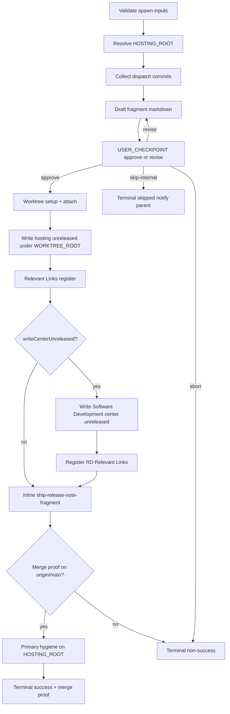

# Capture release note

**Spawn-only (binding).** Squad Leaders spawn this skill **once per dispatch** when the hosting overlay sets **`releaseVersions: release-versions`** and commits landed — see [`../plan.mdc`](../../plan.mdc) § *Release-versions dissolve gate*. Mission Control validates frontmatter **`inputs`** at spawn time. **Forbidden:** running this skill **inline** on the Squad Leader lane as a substitute for the once-per-dispatch child; inventing a second spawn after terminal **`success`**; landing or editing a skill body under **`.sedea/centers/sedea/skills/`** or **`sedea-builtin-center`**.

**Owns:** generate → structured approve/revise **or** skip-internal → write unreleased fragment(s) + Relevant Links (when approved) → run **`ship-release-note-fragment`** **inline** to land a hosting fragment PR that merges the fragment onto **`origin/main`** → verify **merge proof** → terminal **`mission_control_send_agent_result`** with **`releaseNoteStatus`** (`success` with merge proof \| `skipped`) so the Squad Leader dissolve gate can clear. On skip-internal: no write, no fragment PR.

**Out of scope:** overlay enablement; bump/sentinel consolidation; GitHub Release publish; Master Plan / phase planning; dispatch resolution; pre-gap unrelated `??` unreleased files on primary that this run did not author (Step **7** owns primary hygiene for fragments **this run** writes); hosting submodule pin (ship lane after center merge — not this skill).


## Release note content policy (binding)

Unreleased fragments describe **user-facing** or **operator-meaningful** changes only.

| Include | Exclude |
|---------|---------|
| Features, fixes, UX changes, behavior changes visible to users or operators | Submodule pin promotion, gitlink bumps, center pin updates |
| Configuration or workflow changes that affect how people use Sedea | Mechanical hosting-repo housekeeping automated by ship or pin skills |
| Internal-only work when it materially affects operators (document briefly) | PR numbers whose sole purpose is adopting a center submodule tip |

**Forbidden in fragment bullets:** wording such as "bumped … submodule pin", "center governance pins", "gitlink promotion", or "pin PR #N" unless the **user-facing outcome** is the subject (describe the feature or fix, not the pin).

When dispatch commits are **only** pin promotion or gitlink housekeeping with no separate user-facing delta, choose **`skip-internal-not-required`** at Step **4** — do not author a release note.


## Warm-up manifest (spawned)

Per [`.sedea/centers/sedea/docs/lane-manifest-contract.md`](.sedea/centers/sedea/docs/lane-manifest-contract.md) and **`../README.md`** § *Default warm-up*. Host merge: `effectiveWarmUp = dedupe(bootstrapRules → laneRules → skillWarmUp)`. **No `alwaysApply` frontmatter flip.**

### `skillWarmUp` — frontmatter `warmUpRules`

| Path | Purpose |
|------|---------|
| `.sedea/centers/sedea/rules/2_ask-question-instructions.mdc` | Structured choice / Checkpoint gate UX |
| `.sedea/centers/sedea/rules/4_mission.mdc` | Spawn/result / dissolve-gate spawn contract |

### `laneRules` — frontmatter `laneRules`

| Path | Purpose |
|------|---------|
| `.sedea/centers/sedea/rules/2_ask-question-instructions.mdc` | Structured choice |
| `.sedea/centers/sedea/rules/4_mission.mdc` | Mission spawn / terminal result |
| `.sedea/centers/software-development/missions/plan-and-deliver/skills/capture-release-note/SKILL.md` | This skill procedure |
| `.sedea/centers/software-development/missions/plan-and-deliver/skills/README.md` | Spawn contracts, terminal stop |

## Agent messaging (MCP)

| Action | MCP tool |
|--------|----------|
| **This** spawned lane terminal (and terminal re-emits) | **`mission_control_send_agent_result`** |
| Developer approve / revise | **`mission_control_present_structured_choice`** (or AskQuestion when available) |
| Fragment PR ship (after approve + write) | Inline **`ship-release-note-fragment/SKILL.md`** (same lane — no spawn) |
| Optional parent refocus before terminal | **`mission_control_refocus_parent_lane`** |

**Forbidden in MCP args:** host-resolved identity keys (`correlationId`, `dispatchId`, `slotId`, …).

**Forbidden:** **`mission_control_propose_dispatch_resolution`** — only the Squad Leader closes the dispatch. **Forbidden:** spawning **`coding-session`** for fragment ship. Fragment PR create/merge runs via inline **`ship-release-note-fragment`** (which may call hosting **`create-pr`**). **Forbidden:** **`promote-center-submodule-pin`** from this skill.

## Inputs

| Field | Required | Notes |
|-------|----------|-------|
| `baseRef` | no | Default `origin/main` — commit range base for hosting (± Software Development center) |
| `hostingRoot` | no | Absolute **`HOSTING_ROOT`**; resolve by walk-up when omitted |
| `writeCenterUnreleased` | no | Default `false` — set `true` when this dispatch edited Software Development center and an center unreleased write is desired |
| `centerRoot` | no | Absolute Software Development center checkout for optional write / center commit collection |
| `dispatchTitle` | no | Fragment H1 / filename slug hint |

Lane identity supplies **`dispatchId`**, **`operationsDocsDirectory`**, and slot identity — do **not** invent dispatch scope from folder mtimes.

## Execution diagram



## Checkpoint turn UX (skill-local)

Under Checkpoint trust (`trustLevel: checkpoint`), auto-advance scripted happy-path steps; emit structured choice only at **USER_CHECKPOINT** markers in this section, implicit external-wait surfaces, or exception paths. **No cross-skill inheritance** — gate defaults here apply only to **`capture-release-note`**.

Marker syntax: [`.sedea/centers/sedea/docs/user-checkpoint-marker-syntax.md`](.sedea/centers/sedea/docs/user-checkpoint-marker-syntax.md).

**External-wait surfaces (binding):** This skill documents **none** for fragment ship — Step **6** runs **`ship-release-note-fragment`** **inline** on this lane (auto-advance through merge on the clean path).

Fragment approval remains a developer-input **USER_CHECKPOINT**, not external-wait.

| Step | Checkpoint behavior | Gate |
|------|---------------------|------|
| **1** — Validate inputs / resolve roots | Auto-advance | exception: missing hosting root → `failure` |
| **2** — Collect commits | Auto-advance | exception: no commits → `failure` (leader should not have spawned) |
| **3** — Draft fragment | Auto-advance | — |
| **4** — Approve / revise / skip-internal | **Gate** — USER_CHECKPOINT | approve → write; revise → redraft; skip-internal → Step **7** skipped terminal; abort → non-success |
| **5** — Worktree setup + write unreleased path(s) + Relevant Links | Auto-advance after approve | exception: worktree-setup exit **10** or write failure → `failure`; Relevant Links MCP failure → log + continue (do not fail capture); **skip** when Step **4** chose skip-internal |
| **6** — Inline ship-release-note-fragment | Auto-advance full clean ship chain on this lane | exception: ship failure → `failure`; **skip** when Step **4** chose skip-internal |
| **7** — Merge proof + primary hygiene + terminal MCP result | Auto-advance | success only with merge proof + primary hygiene (or skipped internal) — both notify Squad Leader |

## Session orientation table (binding)

**When required:** At the approve/revise **USER_CHECKPOINT** — render as the **first block** in `displayMarkdown`.

| Field | Value |
|-------|-------|
| Plan | — (dissolve-gate skill; no PR plan anchor) |
| Worktree | `<WORKTREE_ROOT>` after Step **5** setup (docs-only hosting worktree) |
| Branch | — |
| Dispatch | `<dispatchId>` from lane identity |
| Fragment draft | `<absolute draft path or "(in recap)">` |
| Hosting unreleased | `<HOSTING_ROOT>/docs/release-notes/unreleased/` |
| center unreleased | `<centerRoot>/docs/release-notes/unreleased/` or — |

## Steps

### 1. Validate inputs and resolve roots

1. Read spawn `inputs` (may be `{}` — all fields optional with defaults).
2. Resolve **`HOSTING_ROOT`**: use `inputs.hostingRoot` when absolute and contains `.sedea/centers/sedea/`; otherwise walk up from cwd until that path exists; on Mission Control prefer MCP **`sedea_get_hosting_root`**.
3. Resolve **`baseRef`** = `inputs.baseRef` or `origin/main`.
4. Record `outputs.writeCenterUnreleased` from input (default `false`).
5. Refresh lane display when stale: title `RN-Capture release note`, description naming the dispatch.

- **Next-step resolution:** Auto-advance to Step **2**.

### 2. Collect dispatch commits

From **`HOSTING_ROOT`** (and optionally **`centerRoot`** when provided or when Software Development center commits are clearly part of this dispatch):

1. Prefer commits attributable to **this dispatch** when the lane or parent handoff names SHAs / worktree ranges.
2. Otherwise collect `git -C <root> log --oneline <baseRef>..HEAD` for:
   - hosting **`HOSTING_ROOT`** (and/or known hosting **`WORKTREE_ROOT`** for this dispatch when passed in initiating context), and
   - Software Development center checkout when `centerRoot` is set or Software Development center commits are clearly part of this dispatch.
3. Build a working set of subjects + short SHAs. Exclude merge-noise and `release-notes:` sentinel commits when obvious.
4. If the working set is **empty**, stop with terminal **`failure`** — `outputs.releaseNoteStatus: failed`, summary stating no commits to note (Squad Leader should have skipped spawn).

- **Next-step resolution:** Auto-advance to Step **3**.

### 3. Draft fragment markdown

Apply [Release note content policy (binding)](#release-note-content-policy-binding) when authoring bullets.

Author a markdown fragment:

```markdown
# <dispatchTitle or short dispatch id>

- <notable change 1>
- <notable change 2>
```

Rules:

- Apply **Release note content policy (binding)** — omit pin-promotion bullets.
- Prefer operator-readable bullets (what changed / why it matters), not raw SHA dumps.
- Include a trailing HTML comment with provenance when useful:
  `<!-- dispatchId: <uuid> ; baseRef: <ref> ; generated: <ISO-date> -->`
- Keep the draft in lane state / recap — **do not** write unreleased paths until Step **4** approves.

- **Next-step resolution:** Auto-advance to Step **4**.

### 4. Structured approve / revise / skip-internal

USER_CHECKPOINT — approve, revise, or skip the release-note fragment before unreleased write. defaultOptionId: approve-fragment

Call **`mission_control_present_structured_choice`** (`modalTitle`: *Release notes — approve fragment*).

**`displayMarkdown` must include:**

1. Session orientation table (binding)
2. The full draft fragment (fenced markdown)
3. Intended write paths (hosting required; Software Development center when `writeCenterUnreleased`)

**Required options** (mission-specific first, then Universal modal trailer):

| Option id | Label |
|-----------|--------|
| `approve-fragment` | Approve — write, ship, and merge fragment |
| `revise-fragment` | Revise — I'll give feedback |
| `skip-internal-not-required` | Internal functionality — release note is not required |
| `abort-capture` | Abort release-note capture |
| `more-details` | More details for option _ |
| `have-question` | I have a question |
| `introspect-incident` | Introspect and report an incident |
| `other` | Other |

| Choice | Action |
|--------|--------|
| `approve-fragment` | Proceed to Step **5** with the draft as approved text (Steps **5–7** and inline ship are non-interactive) |
| `revise-fragment` | Collect feedback (chat / Other); redraft Step **3**; re-open this gate — **do not** write yet |
| `skip-internal-not-required` | **Do not** write unreleased files. Proceed to Step **7** with **`releaseNoteStatus: skipped`** — notify Squad Leader (parent) via terminal result (+ **`mission_control_refocus_parent_lane`** when a parent exists) |
| `abort-capture` | Terminal **`aborted`** with `outputs.releaseNoteStatus: failed` |

**Forbidden:** writing unreleased files before `approve-fragment`; inventing skip outside this gate’s **`skip-internal-not-required`** option; auto-write without this gate; treating skip-internal as **`failed`** (that hard-blocks dissolve).

### 5. Worktree setup + write unreleased fragment(s)

**After** `approve-fragment` — **worktree before first byte** (binding):

1. From **`HOSTING_ROOT`**, run center **`worktree-setup.sh`** (docs-only fragment ship — short **`docs/`** or **`improve/`** worktree name per rule **7**). When hint **`nextAction: attach-required`**, MCP **`sedea_add_worktree_folder`**. Record absolute **`WORKTREE_ROOT`** for this capture pass.
2. When **`worktree-setup.sh`** returns exit **10** (`resolve-dirty-primary`): **stop** — do **not** write on primary; do **not** manually `git worktree add` without an exception gate. Set `outputs.fragmentShipStatus: failed` with `errors[].message` naming blocking dirty paths; proceed to Step **7** terminal **`failure`**.
3. Ensure directory **`WORKTREE_ROOT/docs/release-notes/unreleased/`** exists.
4. Choose a stable filename:
   - Prefer `YYYY-MM-DD-<kebab-dispatch-title-or-short-id>.md`
   - If the file exists, append `-2`, `-3`, … rather than overwrite.
5. **Write** the approved markdown **only** under **`WORKTREE_ROOT/docs/release-notes/unreleased/`** — **forbidden:** creating or modifying the fragment on **`HOSTING_ROOT`** primary working tree.
6. **Relevant Links (first write — binding):** On the **same turn** as the first successful hosting write for this skill run, call MCP **`mission_control_update_relevant_documents`** with the absolute **worktree** fragment path so Mission Control Relevant Links lists the new file. Prefer `{ path, kind: "other", label }` (label = fragment basename or short dispatch title). **Do not** call this before the write succeeds. Host dedupes — safe if the path was already registered.
7. When `writeCenterUnreleased: true` and `centerRoot` is set:
   - Ensure **`centerRoot/docs/release-notes/unreleased/`** exists.
   - Write the same (or center-scoped) fragment with a matching filename under that directory.
   - On that first successful center write, also call **`mission_control_update_relevant_documents`** for the absolute center fragment path (`kind: "other"`).
8. Record absolute paths in `outputs.hostingFragmentPath` (absolute path **under worktree**), `outputs.hostingFragmentRelPath` (repo-relative under hosting), and optional `outputs.centerFragmentPath`. Set `outputs.relevantDocumentsRegistered: true` when the hosting Relevant Links call was attempted after a successful write (even if the stdio MCP ack is transcript-only).

**Forbidden:** writing under `WORKTREE_ROOT/.sedea/operations/`; inventing a second fragment after success on the same dispatch; skipping hosting write when approve succeeded; writing under **`.sedea/centers/sedea/`** or **`sedea-builtin-center`**; registering Relevant Links for a path that was not written this run; treating Relevant Links registration failure as a reason to skip the hosting write; treating Step **5** write alone as terminal **`releaseNoteStatus: success`** (merge proof is Step **7**); **primary-clone `HOSTING_ROOT` write** before worktree setup.

- **Next-step resolution:** Auto-advance to Step **6** (fragment PR handoff). **Do not** emit terminal success after write alone.

### 6. Inline ship-release-note-fragment

**After** Step **5** succeeds (hosting fragment file exists under **`WORKTREE_ROOT`**, not primary):

1. Record `outputs.hostingFragmentPath` (absolute path under **worktree**) and `outputs.hostingFragmentRelPath` (repo-relative path under hosting, for example `docs/release-notes/unreleased/YYYY-MM-DD-….md`).
2. Set `outputs.fragmentShipStatus: pending`.
3. **Read** and execute [`.sedea/centers/software-development/missions/plan-and-deliver/skills/ship-release-note-fragment/SKILL.md`](../ship-release-note-fragment/SKILL.md) **inline** (same agent session — **no** **`mission_control_spawn_agent`**) with:
   - **`repoPath`:** absolute **`HOSTING_ROOT`**
   - **`baseRef`:** `origin/main` (or resolved hosting integration ref)
   - **`hostingFragmentPath`:** absolute path from Step **5** under **worktree** (required)
   - **`hostingFragmentRelPath`:** repo-relative path under hosting (required for merge-proof checks)
   - **`centerFragmentPath`:** optional absolute center unreleased path when written in Step **5**
4. On inline Completion with **`fragmentShipStatus: merged`** and merge-proof fields: proceed to Step **7** merge-proof verification on **this** lane.
5. On inline failure / **`fragmentShipStatus: failed`**: set `outputs.fragmentShipStatus: failed`; proceed to Step **7** with **`releaseNoteStatus: failed`** (do **not** claim success from the local write alone).

**Forbidden:** spawning **`coding-session`** (or any child) for fragment ship; treating local write + Relevant Links as done; skipping Step **6** when approve + write succeeded; Squad Leader owning fragment PR create/merge outside this inline skill.

- **Next-step resolution:** After inline ship completes (or fails), auto-advance to Step **7**.

### 7. Merge proof + primary hygiene + terminal result

**Merge proof (binding — required for `releaseNoteStatus: success`):**

Accept **any one** of:

| Proof | How to verify (from **`HOSTING_ROOT`**) |
|-------|----------------------------------------|
| Path on **`origin/main`** | `git fetch origin main` then `git ls-tree -r --name-only origin/main -- docs/release-notes/unreleased/` contains the fragment basename / repo-relative path |
| Tracked on integration tip | `git ls-files --error-unmatch <repo-relative-path>` after checkout/fetch of a tree that matches **`origin/main`** tip |

**Does not count as merge proof:** file exists only on the primary clone working tree; `??` porcelain; Relevant Links registration alone; child **`releaseNoteStatus`** / write success without path-on-main evidence.

1. When Step **4** chose **`skip-internal-not-required`:** skip merge proof and primary hygiene; emit terminal **`skipped`** as below.
2. Otherwise verify merge proof for `outputs.hostingFragmentRelPath` (repo-relative). Set `outputs.mergeProofVerified: true` and `outputs.mergeProofPath` on success; on failure set `outputs.mergeProofVerified: false` and **`releaseNoteStatus: failed`**.
3. When **`outputs.mergeProofVerified: true`** — **primary hygiene (binding):**
   - From **`HOSTING_ROOT`**: `git fetch origin main`
   - When primary **`HEAD`** lags **`origin/main`**: fast-forward with `git pull origin main` when primary is clean for unrelated paths; when pull is blocked by unrelated dirty state, note in terminal **`summary`** and set `status: partial` if merge proof holds but hygiene could not complete — do not leave stale `??` at `mergeProofPath` unreported
   - When porcelain shows **`??`** at **`mergeProofPath`** while **`origin/main`** already tracks that rel path: remove the untracked duplicate on primary (Path A — this edit pass authored the fragment via worktree ship)
   - Confirm primary has no new `??` or staged change at the fragment path from this run
4. Call **`mission_control_refocus_parent_lane`** with a short reason when a resolvable parent exists (required after **`skip-internal-not-required`**; recommended after merge-proven success).
5. Emit **exactly one** terminal **`mission_control_send_agent_result`**:

| Field | Value on merge-proven happy path | Value on skip-internal |
|-------|----------------------------------|------------------------|
| `status` | `success` | `success` |
| `summary` | 1–3 sentences naming **`releaseNoteStatus: success`**, hosting fragment path, **merge proof** (path on `origin/main`), and optional center path | 1–3 sentences naming **`releaseNoteStatus: skipped`**, reason **internal functionality — release note is not required**, and that no fragment was written — Squad Leader may clear dissolve hard-block |
| `outputs.releaseNoteStatus` | `success` | `skipped` |
| `outputs.skipReason` | omit | `internal-functionality-not-required` |
| `outputs.releaseNoteWritten` | `true` | `false` |
| `outputs.mergeProofVerified` | `true` | omit / `false` |
| `outputs.mergeProofPath` | Repo-relative path proven on `origin/main` | omit |
| `outputs.hostingFragmentPath` | Absolute path written | omit |
| `outputs.centerFragmentPath` | Absolute path when written; omit otherwise | omit |
| `outputs.fragmentFilename` | Basename only | omit |
| `outputs.relevantDocumentsRegistered` | `true` after Step **5** Relevant Links call for the hosting fragment | omit / `false` |
| `outputs.fragmentShipStatus` | `merged` | omit |

On abort / failure / write error / missing merge proof: `status` ∈ `aborted` \| `failure` \| `partial`; `outputs.releaseNoteStatus: failed`; include `errors[].message` when useful.

**Name `releaseNoteStatus` and merge-proof outcome in `summary`** so the Squad Leader dissolve gate can clear hard-block only when proof (or skip) is present.

## Completion (spawned)

### Host protocol line

Call MCP **`mission_control_send_agent_result`** exactly once at skill terminal (re-call after follow-up on the same lane if the developer continues after a prior terminal).

### Outputs

| Field | Type | Notes |
|-------|------|-------|
| `releaseNoteStatus` | string | `success` \| `skipped` \| `failed` — leader maps to dissolve gate; **`success` requires merge proof** |
| `skipReason` | string | Present when skipped — `internal-functionality-not-required` |
| `releaseNoteWritten` | boolean | `true` after hosting write; `false` on skip-internal |
| `mergeProofVerified` | boolean | `true` when fragment path proven on `origin/main` |
| `mergeProofPath` | string | Repo-relative path proven on integration tip |
| `fragmentShipStatus` | string | `pending` \| `merged` \| `failed` — inline ship-release-note-fragment |
| `hostingFragmentPath` | string | Absolute path under hosting worktree unreleased (worktree-first after Step **5**) |
| `centerFragmentPath` | string | Optional absolute Software Development center unreleased path |
| `fragmentFilename` | string | Basename |
| `relevantDocumentsRegistered` | boolean | Hosting fragment registered via **`mission_control_update_relevant_documents`** after first write |
| `baseRef` | string | Range base used |
| `commitCount` | number | Commits considered in the draft |

## Completion (inline)

**Not supported.** This skill is spawn-only. If invoked inline by mistake: stop; tell the invoker to spawn `.sedea/centers/software-development/missions/plan-and-deliver/skills/capture-release-note/SKILL.md` with slug `release-note` per the dissolve gate.

## Anti-patterns (binding)

| Anti-pattern | Correct action |
|--------------|----------------|
| Auto-write without approve gate | Step **4** USER_CHECKPOINT first |
| Ad-hoc skip / close without notes outside the gate | Only **`skip-internal-not-required`** at Step **4** authorizes skip; terminal **`releaseNoteStatus: skipped`** notifies Squad Leader |
| Treating skip-internal as `failed` | Use **`skipped`** so dissolve hard-block clears |
| Second spawn after `releaseNoteStatus: success` or `skipped` | Leader once-per-dispatch — this skill does not re-open |
| Write only Software Development center, skip hosting | Hosting write is required on approve |
| Terminal **`success`** after local write without merge proof | Step **6** inline fragment ship + Step **7** merge proof required |
| Skipping inline ship after approve + write | Run **`ship-release-note-fragment`** Step **6** with abs/rel fragment paths |
| Spawning **`coding-session`** for fragment ship | Inline **`ship-release-note-fragment`** on this lane |
| Skip Relevant Links after first hosting write | Step **5** item **4** — call **`mission_control_update_relevant_documents`** same turn |
| Fail capture because Relevant Links MCP ack is transcript-only | Registration is best-effort for panel UX; fragment write + merge proof + **`releaseNoteStatus`** still govern dissolve |
| Land skill under builtin-center / `.sedea/centers/sedea/skills/` | software-development plan-and-deliver path only |
| Pin-promotion bullets in release notes | Apply **Release note content policy**; use **skip-internal** when commits are pin-only |
| Primary HOSTING_ROOT write before worktree | Step **5** worktree-first only — write under **`WORKTREE_ROOT`** |
| Leave primary `??` duplicate after merge proof | Step **7** primary hygiene — remove stale untracked when path is on `origin/main` |
| Edit overlay / bump scripts here | Out of scope — later phases |
| Prose-only idle at approve gate | Always MCP structured choice |
